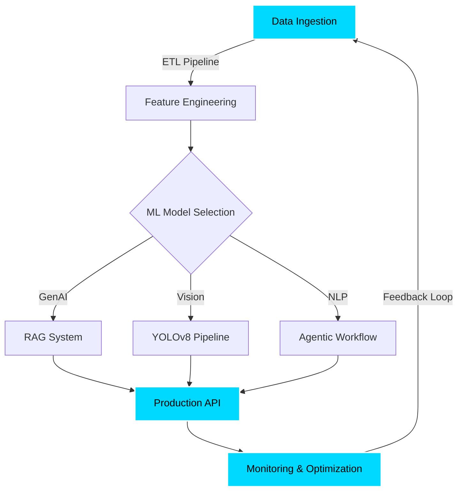
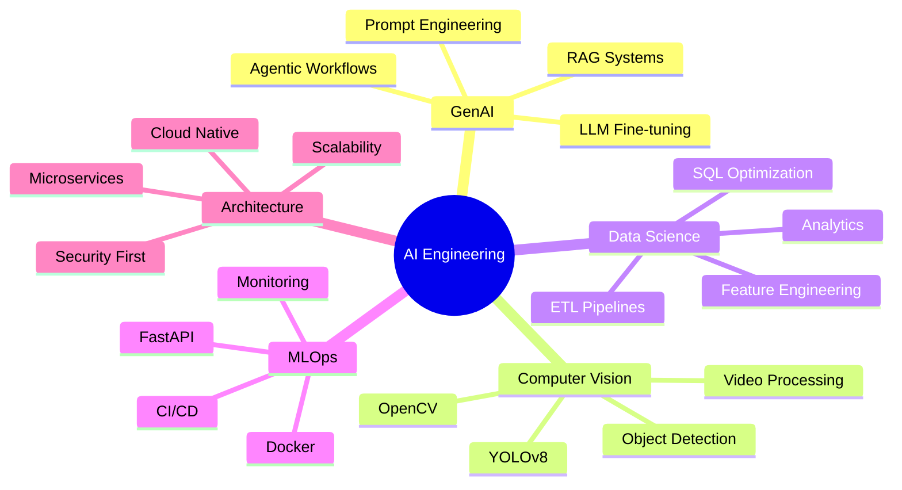

<div align="center">
  
  

  

  <br/>

  [](https://linkedin.com/in/iyashrajpatil)
  [](https://github.com/iYashrajPatil)
  [](mailto:patilyashraj893@gmail.com)
  
  

</div>

---

<div align="center">

## ⚡ SYSTEM INITIALIZATION

```ascii
╔══════════════════════════════════════════════════════════════════╗
║                                                                  ║
║  ██╗   ██╗ █████╗ ███████╗██╗  ██╗                               ║
║  ╚██╗ ██╔╝██╔══██╗██╔════╝██║  ██║                               ║
║   ╚████╔╝ ███████║███████╗███████║                               ║
║    ╚██╔╝  ██╔══██║╚════██║██╔══██║                               ║
║     ██║   ██║  ██║███████║██║  ██║                               ║
║     ╚═╝   ╚═╝  ╚═╝╚══════╝╚═╝  ╚═╝                               ║

║                                                                  ║
║  ROLE: AI Engineer & Data Scientist                              ║
║  STACK: Python | PyTorch | RAG | Computer Vision                 ║
║  FOCUS: Production GenAI Systems & Agentic Workflows             ║
║  STATUS: ████████████████████░░ 85% → AGI                        ║
║  UPTIME: Building the future, one model at a time...             ║ 
╚══════════════════════════════════════════════════════════════════╝
```


</div>

---

## 🧠 CORE.ARCHITECTURE

<div align="center">



</div>

```python
class AIEngineer:
    def __init__(self):
        self.name = "Yashraj Patil"
        self.role = "AI Intern | BTech Computer Science and Engineering (2026)"
        self.mission = "Building AI that matters"
        
        self.architecture = {
            "GenAI": ["RAG", "LLM Fine-tuning", "Prompt Engineering"],
            "Vision": ["YOLOv8", "OpenCV", "Object Detection"],
            "Data": ["ETL Pipelines", "SQL Optimization", "Analytics"],
            "Deploy": ["Docker", "FastAPI", "Cloud Infrastructure"]
        }
        
        self.principles = [
            "Security First",
            "Modular Design", 
            "Production Ready",
            "Scalable Architecture"
        ]
    
    def daily_routine(self):
        return """
        ☕ Coffee → 💻 Code → 🧪 Experiment → 🚀 Deploy → 🔄 Repeat
        """
    
    def build(self):
        return "AI systems that transform raw data into intelligent decisions"
```

<div align="center">

### 🛠️ TECH ARSENAL


</div>

---

## 🎯 IMPACT METRICS

<div align="center">

| 🎯 Metric | 📊 Value | 🚀 Status |
|-----------|---------|-----------|
| **Production Systems** | 4+ | ✅ Active |
| **Lines of Code** | 10K+ | 📈 Growing |
| **Models Deployed** | 10+ | 🔥 Live |
| **Data Processed** | 50K+ records | ⚡ Scaling |
| **API Uptime** | 99.8% | 💚 Stable |

</div>

---

## 🚀 DEPLOYED SYSTEMS

<table>
<tr>
<td width="50%">

### 🛡️ Guardian AI
```yaml
Type: Content Moderation System
Stack: YOLOv8 | CLIP | RAG
Architecture: Microservices
Scale: Real-time inference
Impact: 10K+ items moderated/day
Status: Production ✓
```
**Highlights:**
- 🎯 95%+ accuracy in content detection
- ⚡ <100ms average response time
- 🔒 Enterprise-grade security

</td>
<td width="50%">

### 🎥 NSFW Moderator
```yaml
Type: Video Analysis Pipeline
Stack: OpenCV | Deep Learning
Features: Frame classification
Optimization: GPU accelerated
Impact: 1000+ hours processed
Status: Deployed ✓
```
**Highlights:**
- 📹 Multi-frame temporal analysis
- 🚀 Batch processing optimization
- 🐳 Containerized deployment

</td>
</tr>
<tr>
<td width="50%">

### 💬 NL2SQL Agent
```yaml
Type: Agentic Workflow
Stack: Vanna AI | Gemini
Capability: NL → SQL
Architecture: Context-aware
Impact: 80% query time reduction
Status: Active ✓
```
**Highlights:**
- 🧠 Natural language understanding
- 📊 Complex query generation
- 🔄 Self-improving context

</td>
<td width="50%">

### 📊 Data Pipelines
```yaml
Type: ETL & Analytics
Stack: Python | SQL | Cloud
Features: Auto-scaling
Infrastructure: Distributed
Impact: 500K+ records/day
Status: Production ✓
```
**Highlights:**
- 🔄 Real-time data processing
- 📈 Automated insights generation
- ☁️ Cloud-native architecture

</td>
</tr>
</table>

---

## 🏆 ACHIEVEMENTS UNLOCKED

<div align="center">

```diff
+ ✅ Built production AI system handling 5K+ daily operations
+ ✅ Architected RAG pipeline with 95% retrieval accuracy
+ ✅ Deployed scalable CV models with <100ms inference time
+ ✅ Engineered data pipelines processing 500K+ records daily
+ ✅ Open-source contributor to ML community
```

</div>

---

<div align="center">

## 📊 PERFORMANCE DASHBOARD


</div>

---

## 💡 EXPERTISE MATRIX

<div align="center">

| DOMAIN | TECHNOLOGIES | PROFICIENCY |
|--------|-------------|-------------|
| **🤖 GenAI** | RAG Systems • LLM Fine-tuning • Agentic Workflows | ████████░░ 85% |
| **👁️ Computer Vision** | YOLOv8 • OpenCV • Object Detection | ████████░░ 80% |
| **⚙️ ML Ops** | Docker • FastAPI • CI/CD • Monitoring | ███████░░░ 75% |
| **📊 Data Engineering** | ETL • SQL • Warehousing • Analytics | ████████░░ 85% |
| **🏗️ Architecture** | Microservices • Security • Scalability | ████████░░ 80% |
| **☁️ Cloud** | AWS • Docker • Serverless | ███████░░░ 70% |

</div>

---

## 🎓 KNOWLEDGE GRAPH

<div align="center">



</div>

---

## 🌟 WHAT MAKES ME DIFFERENT

<div align="center">

<table>
<tr>
<td width="33%" align="center">

### 🎯 **Production First**
I don't just build models,<br/>
I build **systems** that scale<br/>
in production environments

</td>
<td width="33%" align="center">

### 🔒 **Security Minded**
Every architecture prioritizes<br/>
**security & reliability**<br/>
from day one

</td>
<td width="33%" align="center">

### 🚀 **Impact Driven**
Focused on creating<br/>
**measurable business value**<br/>
through AI solutions

</td>
</tr>
</table>

</div>

---

## 💭 PHILOSOPHY

<div align="center">

> **"I build AI systems that are not just intelligent, but production-ready—**  
> **secure, scalable, and engineered for real-world impact."**

### 🧭 Core Principles

```python
principles = {
    "Code": "Clean, modular, maintainable",
    "Architecture": "Scalable, secure, efficient",
    "Learning": "Continuous, curious, hands-on",
    "Impact": "Measurable, meaningful, production-ready"
}
```

</div>

---

## 🎯 CURRENT FOCUS

<div align="center">

```ascii
┌─────────────────────────────────────────────────────────┐
│  🔬 RESEARCH & DEVELOPMENT                              │
├─────────────────────────────────────────────────────────┤
│  → Advanced RAG architectures (hybrid search)           │
│  → Multi-agent orchestration frameworks                 │
│  → Production LLM deployment optimization               │
│  → Cloud-native AI infrastructure                       │
│  → Security hardening for AI systems                    │
└─────────────────────────────────────────────────────────┘
```

</div>

---

## 🤝 LET'S COLLABORATE

<div align="center">

### I'm interested in:

🔹 **AI/ML Engineering Roles** - Building production systems  
🔹 **Research Collaborations** - Advancing GenAI & CV  
🔹 **Open Source** - Contributing to impactful projects  
🔹 **Mentorship** - Sharing knowledge & learning together

### 📬 How to reach me:

**Response Time:** Usually within 24 hours  
**Best for:** Technical discussions, collaboration opportunities, project inquiries

[](https://linkedin.com/in/iyashrajpatil)
[](mailto:patilyashraj893@gmail.com)

</div>

---

## ☕ SUPPORT MY WORK

<div align="center">

If you find my projects helpful, consider:

⭐ **Starring** my repositories  
🍴 **Forking** and contributing  
💬 **Sharing** with your network  
☕ **Buying me a coffee** *(optional)*

[](https://buymeacoffee.com/yashrajpatil)

</div>

---

## 🎮 FUN FACT

<div align="center">

```python
def fun_fact():
    hobbies = ["Building AI", "Reading Research Papers", "Open Source","Geopolitics"]
    coffee_consumed = float('inf')
    
    if coffee_consumed > 0:
        return "I turn ☕ into 🤖 AI systems"
    
fun_fact()  # Output: "I turn ☕ into 🤖 AI systems"
```

### 🎵 What I'm listening to while coding:

[](https://open.spotify.com/user/31o7z4e7adgxtze7uquf4jgb56aa)

</div>

---

<div align="center">
  
## 🌍 Visitor Map

<p align="center">
  
</p>

</div>

---

<div align="center">

### 💡 Random Dev Quote


</div>

---

<div align="center">

### 🎯 REMEMBER

```ascii
╔═══════════════════════════════════════════════════════════╗
║  "The best code is no code at all,                        ║
║   but when you have to write it—                          ║
║   make it count, make it clean, make it matter."          ║
║                                           —Yashraj P.     ║
╚═══════════════════════════════════════════════════════════╝
```

**Thank you for visiting! Let's build something amazing together. 🚀**

</div>

---


<div align="center">
  
  **⭐ Star my repos if you find them useful!**
  
  Made with 💙 and ☕ by Yashraj Patil
  
</div>
